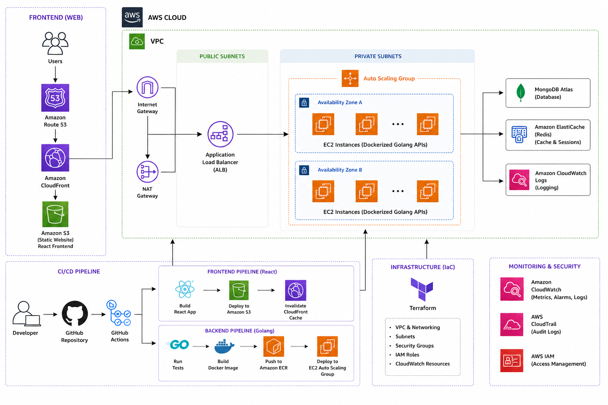

# Architecture Documentation

## System Overview

MuchToDo is a full-stack task management application split into two independently deployable layers — a **static React SPA** and a **containerised Go REST API** — both running on AWS inside a single VPC.



---

## Table of Contents

1. [High-Level Architecture](#1-high-level-architecture)
2. [Network Layout](#2-network-layout)
3. [Frontend Layer](#3-frontend-layer)
4. [Backend Layer](#4-backend-layer)
5. [Data Layer](#5-data-layer)
6. [Authentication & Session Model](#6-authentication--session-model)
7. [Caching Strategy](#7-caching-strategy)
8. [CI/CD Pipelines](#8-cicd-pipelines)
9. [Infrastructure as Code](#9-infrastructure-as-code)
10. [Security Design](#10-security-design)
11. [Observability](#11-observability)
12. [Scaling Strategy](#12-scaling-strategy)
13. [Data Flow Walkthroughs](#13-data-flow-walkthroughs)
14. [Architecture Decision Records](#14-architecture-decision-records)

---

## 1. High-Level Architecture

```
                        ┌──────────────────────────────────────────────────────────┐
                        │                      AWS CLOUD                           │
  ┌──────────┐          │  ┌────────────────────────────────────────────────────┐  │
  │  Users   │          │  │                        VPC                         │  │
  └────┬─────┘          │  │                                                    │  │
       │                │  │  PUBLIC SUBNETS          PRIVATE SUBNETS           │  │
       ▼                │  │  ┌──────────────┐        ┌───────────────────────┐ │  │
  ┌──────────┐          │  │  │  Internet GW │        │   Auto Scaling Group  │ │  │
  │ Route 53 │          │  │  └──────┬───────┘        │  ┌─────────────────┐  │ │  │
  └────┬─────┘          │  │         │                │  │  AZ-A  EC2s     │  │ │  │
       │                │  │  ┌──────▼───────┐        │  └─────────────────┘  │ │  │
       ├──(static)──────┼──┼─►│  CloudFront  │        │  ┌─────────────────┐  │ │  │
       │                │  │  └──────┬───────┘        │  │  AZ-B  EC2s     │  │ │  │
       │                │  │         │                │  └─────────────────┘  │ │  │
       │                │  │  ┌──────▼───────┐        └───────────┬───────────┘ │  │
       │                │  │  │  S3 Bucket   │                    │             │  │
       │                │  │  │  (React SPA) │        ┌───────────▼───────────┐ │  │
       │                │  │  └──────────────┘        │  ElastiCache (Redis)  │ │  │
       │                │  │                          └───────────────────────┘ │  │
       ├──(api)─────────┼──┼─►  ALB ────────────────► EC2 ASG                  │  │
       │                │  │  ┌──────────────┐                                  │  │
       │                │  │  │  NAT Gateway │  (EC2 egress)                    │  │
       │                │  │  └──────────────┘                                  │  │
       │                │  └────────────────────────────────────────────────────┘  │
       │                │                                                           │
       │                │  ┌────────────────┐   ┌───────────────┐                  │
       │                │  │ CloudWatch     │   │  CloudTrail   │                  │
       │                │  │ (Logs/Metrics) │   │  (Audit)      │                  │
       │                │  └────────────────┘   └───────────────┘                  │
       │                └──────────────────────────────────────────────────────────┘
       │
       │                  External SaaS
       └──────────────► MongoDB Atlas (TLS, IP-allowlisted NAT Gateway EIPs)
```

---

## 2. Network Layout

### VPC Structure

The VPC is divided into two tiers across two Availability Zones for fault tolerance:

| Subnet Type | Contents | Internet Access |
|---|---|---|
| **Public** | Internet Gateway, NAT Gateway, ALB | Direct inbound (ALB only) |
| **Private** | EC2 Auto Scaling Group, ElastiCache Redis | Outbound only via NAT Gateway |

### Security Group Rules

**ALB Security Group**
- Inbound: `0.0.0.0/0` on port 80 (HTTP redirect) and 443 (HTTPS)
- Outbound: EC2 security group on port 8080 only

**EC2 Security Group**
- Inbound: ALB security group on port 8080 only — no direct public access
- Outbound: ElastiCache security group on port 6379, `0.0.0.0/0` on 443 (MongoDB Atlas, ECR, CloudWatch)

**ElastiCache Security Group**
- Inbound: EC2 security group on port 6379 only
- Outbound: None

### Why Two Availability Zones?

The ASG distributes instances across AZ-A and AZ-B. If one AZ becomes unhealthy, the ALB stops routing to it and the ASG launches replacement capacity in the surviving AZ within minutes, without any manual intervention.

---

## 3. Frontend Layer

### Static Site Architecture

```
Browser
  │
  ▼
Route 53 (DNS A record → CloudFront)
  │
  ▼
CloudFront (CDN — global edge nodes)
  │  ├── Cache HIT  → serves from edge (< 10 ms)
  │  └── Cache MISS → origin request to S3 via OAC
  ▼
S3 Bucket (private — zero public access)
  └── React SPA (index.html + hashed JS/CSS/asset bundles)
```

### Key Design Decisions

**S3 + CloudFront over EC2 hosting**: Static files have no compute requirements. S3 + CloudFront delivers sub-10ms edge responses globally, costs orders of magnitude less than running web servers, and eliminates a whole class of web-server vulnerabilities.

**Origin Access Control (OAC)**: The S3 bucket has `Block Public Access` fully enabled. CloudFront authenticates to S3 using a signed request (OAC), so objects are never directly reachable via S3 URLs. This prevents content hotlinking and bypassing of CloudFront's WAF rules if one were added.

**Cache-Control split strategy**:
- `index.html` — `no-cache, no-store, must-revalidate`: the browser always fetches the latest HTML, which references hashed asset filenames. This means users get new JS/CSS immediately after a deploy without a full CloudFront invalidation of every asset.
- Hashed assets (`/assets/index-abc123.js`) — `public, max-age=31536000, immutable`: safe to cache forever at the edge and in the browser because the filename changes with every build. Zero re-validation traffic.

**CloudFront invalidation on deploy**: After S3 sync, the pipeline creates a `/*` invalidation and waits for it to complete before the smoke test runs. This guarantees the CDN edge serves the new build before the pipeline marks a deployment successful.

### SPA Technology Choices

| Decision | Choice | Rationale |
|---|---|---|
| Router | TanStack Router | Type-safe file-based routing with first-class loader support |
| Server state | TanStack Query | Automatic background refetch, cache invalidation, loading/error states |
| Forms | React Hook Form + Zod | Uncontrolled inputs (no re-render per keystroke), schema-driven validation |
| Auth state | React Context + `useAuth` hook | Auth is cross-cutting; avoids prop-drilling without adding a state library |
| UI primitives | Radix UI / shadcn | Accessible, unstyled headless primitives; keeps design system in our control |
| HTTP client | Axios with `withCredentials: true` | Automatic cookie inclusion on cross-origin requests (required for httpOnly JWT) |

---

## 4. Backend Layer

### Container Architecture

```
EC2 Instance (private subnet, no public IP)
  │
  └── Docker container (Go API — scratch image)
        ├── /server  (statically compiled binary, ~10 MB)
        ├── ca-certificates (TLS to MongoDB Atlas)
        └── /etc/passwd (nobody user)
```

### Multi-Stage Dockerfile

```
Stage 1: golang:1.25-alpine (builder)
  ├── go mod download (layer-cached)
  ├── CGO_ENABLED=0 go build → /app/server
  └── -ldflags="-w -s" strips debug symbols → smaller binary

Stage 2: scratch (runtime)
  ├── COPY ca-certificates (TLS support only)
  ├── COPY /etc/passwd (non-root user support only)
  ├── COPY /app/server
  └── USER nobody
```

Using `scratch` as the runtime base means the final image has no shell, no package manager, no OS utilities — only the binary and the TLS certificates it needs. This eliminates the vast majority of OS-level CVEs that Trivy would otherwise flag.

### Application Bootstrap Sequence (`cmd/api/main.go`)

```
1. config.LoadConfig(".")
   └── Viper reads .env file + env vars (env vars win on conflict)

2. logger.InitLogger(cfg)
   └── slog JSON handler (production) or text handler (local)

3. database.ConnectMongo(cfg.MongoURI, cfg.DBName)
   └── 10 s timeout, primary-node ping to verify

4. cache.NewCacheService(cfg)
   ├── ENABLE_CACHE=true  → RedisCache (go-redis, connection verified with PING)
   └── ENABLE_CACHE=false → NoOpCache (all ops no-op, cache misses return redis.Nil)

5. auth.NewTokenService(cfg.JWTSecretKey, cfg.JWTExpirationHours)
   └── HS256 JWT generator/validator

6. preloadUsernamesIntoCache(...)
   └── On first boot, bulk-loads all usernames into Redis with 24h TTL
       guarded by a sentinel key to prevent redundant reloads

7. setupRouter(...)
   └── gin.ReleaseMode, CORS middleware, auth middleware, route registration

8. startServer(...) with graceful shutdown (SIGINT/SIGTERM, 5 s drain)
```

### Request Lifecycle

```
HTTP Request
    │
    ▼
CORS Middleware (validates Origin header against ALLOWED_ORIGINS)
    │
    ▼
Auth Middleware (protected routes only)
    ├── 1. Check httpOnly cookie "token"
    ├── 2. Fallback to Authorization: Bearer <token>
    ├── 3. tokenService.ValidateToken → extracts userID claim
    └── 4. c.Set("userID", userID) → available to all downstream handlers
    │
    ▼
Handler
    ├── Input binding + Zod-equivalent validation (gin binding tags)
    ├── Cache check (if applicable)
    ├── MongoDB operation
    └── JSON response
```

### Route Registration

Routes are registered in `internal/routes/routes.go`:

```
Public
  GET  /health          → HealthHandler.CheckHealth
  GET  /swagger/*       → Swagger UI (dynamic host/scheme detection)
  POST /auth/register   → UserHandler.Register
  POST /auth/login      → UserHandler.Login
  POST /auth/logout     → UserHandler.Logout
  GET  /auth/username-check/:username → UserHandler.CheckUsernameAvailability

Protected (AuthMiddleware applied)
  GET    /users/me          → UserHandler.GetCurrentUser
  PUT    /users/me          → UserHandler.UpdateUser
  PUT    /users/me/password → UserHandler.ChangePassword
  DELETE /users/me          → UserHandler.DeleteUser

  GET    /tasks             → TodoHandler.GetAllTodos
  POST   /tasks             → TodoHandler.CreateTodo
  GET    /tasks/:id         → TodoHandler.GetTodoByID
  PUT    /tasks/:id         → TodoHandler.UpdateTodo
  DELETE /tasks/:id         → TodoHandler.DeleteTodo
```

> **Note:** The route prefix is `/tasks` (not `/todos`) to avoid conflicts with the frontend's own `/todos` client-side route.

---

## 5. Data Layer

### MongoDB Atlas

MongoDB Atlas is used as a managed external SaaS rather than a self-hosted instance. This offloads replication, backups, patching, and monitoring to Atlas while keeping costs predictable at small scale.

**Collections:**

| Collection | Key fields | Indexes (recommended) |
|---|---|---|
| `users` | `_id`, `username`, `password` (bcrypt), `firstName`, `lastName`, `createdAt`, `updatedAt` | Unique index on `username` |
| `todos` | `_id`, `userId` (ObjectID ref), `title`, `description`, `completed`, `createdAt`, `updatedAt` | Index on `userId` for per-user queries |

**Connectivity:** EC2 instances egress through the NAT Gateway. The NAT Gateway's Elastic IPs must be added to the MongoDB Atlas IP Access List. This is the only way Atlas permits connections from the backend.

**Transactional deletes:** Account deletion (`DELETE /users/me`) runs inside a MongoDB multi-document transaction (via `session.WithTransaction`) to atomically delete the user document and all their todos. If either operation fails, both are rolled back.

### ElastiCache Redis

Redis serves two purposes:

1. **Username availability cache** — Pre-populated on startup with all existing usernames under keys `username-taken:<username>`. A 24-hour TTL ensures the cache stays reasonably fresh. A 5% probabilistic background refresh on every `username-check` request further keeps the cache warm without blocking requests.

2. **Cache interface abstraction** — The `cache.Cache` interface has two implementations:
   - `RedisCache` — real Redis backed by go-redis v9
   - `NoOpCache` — all methods are no-ops; `Get` always returns `redis.Nil` (cache miss). Enabled when `ENABLE_CACHE=false`.

   This means the application logic never branches on `cfg.EnableCache`. Disabling the cache is purely a deployment concern.

---

## 6. Authentication & Session Model

### Token Issuance (`POST /auth/login`)

```
1. Lookup user by username in MongoDB
2. bcrypt.CompareHashAndPassword(stored_hash, provided_password)
3. tokenService.GenerateToken(user.ID.Hex())
   └── HS256 JWT, claims: { sub: userID, iat, exp }
4. c.SetCookie("token", jwt, expiry, "/", domain, SECURE_COOKIE, httpOnly=true)
5. Response body also includes the raw token (for API clients that can't access cookies)
```

### Token Validation (Auth Middleware)

```
1. Read cookie "token"       → present?  use it
2. Read Authorization header → Bearer <token>?  use it
3. tokenService.ValidateToken(tokenString)
   ├── Parse JWT with HS256 + secret
   ├── Verify signature
   ├── Check exp claim
   └── Extract sub claim → userID string
4. c.Set("userID", userID)
```

### Cookie Security

| Flag | Value | Reason |
|---|---|---|
| `HttpOnly` | `true` | Prevents JavaScript from reading the token — mitigates XSS token theft |
| `Secure` | `cfg.SecureCookie` (`true` in prod) | Cookie only sent over HTTPS |
| `SameSite` | Default (Lax) | Mitigates CSRF for top-level navigations |
| `Domain` | `utils.GetCookieDomain(...)` | Scoped to the actual request host from `COOKIE_DOMAINS` allowlist |
| `Path` | `/` | Available to all API routes |

### Password Storage

Passwords are hashed with `bcrypt` at cost factor 14 (`bcrypt.GenerateFromPassword(password, 14)`). The `password` field is tagged `json:"-"` on the `User` model, so it is never serialised into any API response regardless of which handler is called.

---

## 7. Caching Strategy

### Username Availability

The username availability check (`GET /auth/username-check/:username`) is expected to be called frequently during registration (e.g. on every keystroke). Without caching, each call would be a MongoDB `countDocuments` query.

**Cache population flow:**

```
Application startup
  └── preloadUsernamesIntoCache()
        ├── Check sentinel key "username_cache_initialized" in Redis
        ├── If absent: query MongoDB users collection (projection: {username: 1})
        ├── Build map { "username-taken:<name>": true }
        ├── cacheSvc.SetMany(map, 24h TTL)  ← Redis pipeline, single round-trip
        └── Set sentinel key (24h TTL)

New user registered (POST /auth/register)
  └── cacheSvc.Set("username-taken:<username>", true, 5m TTL)

Username-check request (GET /auth/username-check/:username)
  ├── 5% chance: trigger background goroutine to refresh full cache
  ├── cacheSvc.Get("username-taken:<username>")
  │     ├── HIT (taken=true)  → return {available: false}  ← no DB call
  │     └── MISS              → MongoDB countDocuments
  │                                 ├── count > 0 → cache the key, return {available: false}
  │                                 └── count = 0 → return {available: true}
```

**Why probabilistic refresh?** A 24-hour TTL means the cache could drift if many users register between refreshes. The 5% chance on each request triggers an async full refresh without adding latency to any individual request and without requiring a cron job or scheduler.

---

## 8. CI/CD Pipelines

### Pipeline Triggers

Both pipelines use path filtering so only changed layers trigger a run:

```yaml
# Frontend pipeline triggers on:
paths: ['frontend/**', '.github/workflows/frontend-ci-cd.yml']

# Backend pipeline triggers on:
paths: ['backend/**', '.github/workflows/backend-ci-cd.yml']
```

### Frontend Pipeline Detail

```
Job: build  (all branches on push/PR)
─────────────────────────────────────
actions/setup-node@v4  (Node 20, npm cache)
npm ci
eslint .
npm audit --audit-level=high           (continue-on-error: true)
VITE_API_BASE_URL=${{ secrets.VITE_API_BASE_URL }} npm run build
[verify dist/ exists]
actions/upload-artifact@v4  (frontend-dist, 1-day retention)

Job: deploy  (main push only, requires build)
─────────────────────────────────────────────
actions/configure-aws-credentials@v4
actions/download-artifact@v4  (frontend-dist)

aws s3 sync ./dist → s3://$BUCKET
  ├── Pass 1: *.html  → --cache-control "no-cache, no-store, must-revalidate"
  └── Pass 2: rest    → --cache-control "public, max-age=31536000, immutable"

aws cloudfront create-invalidation --paths "/*"
aws cloudfront wait invalidation-completed

curl $CLOUDFRONT_DOMAIN → assert HTTP 200 (smoke test)
```

### Backend Pipeline Detail

```
Job: test  (all branches on push/PR)
─────────────────────────────────────
actions/setup-go@v5  (Go 1.22, go.sum cache)
go mod download
go mod tidy + git diff --exit-code    (ensures go.mod is committed clean)
go test -v -race -coverprofile=coverage.out ./...
go tool cover -html → coverage.html   (uploaded as artifact)
go vet ./...
staticcheck ./...                     (continue-on-error: true)
gosec ./...                           (continue-on-error: true)

Job: build  (main push only, requires test)
────────────────────────────────────────────
aws-actions/configure-aws-credentials@v4
aws-actions/amazon-ecr-login@v2
[generate image tag = github.sha]
docker/setup-buildx-action@v3
docker/build-push-action@v5
  ├── push: false, load: true
  ├── cache-from/to: type=gha    (GitHub Actions cache)
  └── tags: <registry>/<repo>:<sha>, :latest

aquasecurity/trivy-action  (exit-code: 1 on CRITICAL)  ← blocks push
                            (continue-on-error: true in current config)

docker push :<sha>
docker push :latest

Job: deploy  (requires build, environment: production)
────────────────────────────────────────────────────────
[Get Launch Template ID from ASG description]
[Get latest LT version number]
aws ec2 create-launch-template-version
  └── source-version: $LATEST, description: "deploy-<sha>"
aws autoscaling update-auto-scaling-group
  └── launch-template: id=$LT_ID, version=$NEW_VERSION

aws autoscaling start-instance-refresh
  └── strategy: Rolling
      MinHealthyPercentage: 50
      InstanceWarmup: 60s
      CheckpointPercentages: [50, 100]
      CheckpointDelay: 30s

Poll describe-instance-refreshes every 30s × 40 attempts (20 min max)
  ├── Successful → continue
  └── Failed / Cancelled → rollback-instance-refresh + exit 1

curl $ALB_DNS/health → 10 × assert HTTP 200 (10s gap)
```

### Rolling Deployment Strategy

The `MinHealthyPercentage: 50` setting means at any point during a deploy, at least half the instances are serving traffic. For a 2-instance minimum ASG:

```
Before:  [v1] [v1]
Step 1:  [v1] [--]   (one instance terminated, new one launching)
Step 2:  [v1] [v2]   (checkpoint at 50% — waits 30s)
Step 3:  [--] [v2]   (second old instance replaced)
After:   [v2] [v2]
```

If the refresh enters `Failed` status, the pipeline calls `rollback-instance-refresh`, which reverts the ASG to the previous Launch Template version and restarts the refresh in reverse.

---

## 9. Infrastructure as Code

Terraform manages all AWS resources. Resources are grouped by concern:

| Resource Group | What it creates |
|---|---|
| **VPC & Networking** | VPC, public/private subnets (×2 AZs), Internet Gateway, NAT Gateway, route tables, EIPs |
| **Security Groups** | ALB SG, EC2 SG, ElastiCache SG with minimal ingress rules |
| **IAM** | EC2 instance role with `CloudWatchAgentServerPolicy`, `AmazonSSMManagedInstanceCore`, scoped ECR pull policy |
| **EC2 / ASG** | Launch Template (AMI, instance type, user-data, IAM profile), Auto Scaling Group, scaling policies |
| **ElastiCache** | Redis subnet group, parameter group, replication group |
| **CloudWatch** | Log groups, metric alarms (CPU high/low, ALB 5xx rate), dashboard, SNS topic for alarm notifications |

### Sensitive Values

Secrets (`MONGO_URI`, `JWT_SECRET_KEY`, `REDIS_PASSWORD`) are passed into the Launch Template user-data as shell environment variable exports. They are stored in **GitHub Actions Secrets**, never in Terraform state or source control. Terraform variables for these values use `sensitive = true` to suppress them from plan output.

**Production hardening path:** Replace user-data environment variable injection with `aws secretsmanager get-secret-value` calls at instance boot. This eliminates secrets from the Launch Template entirely and allows rotation without redeploying.

---

## 10. Security Design

### Defence-in-Depth Layers

```
Layer 1 — Network
  - Private subnets for all compute
  - Security groups enforcing minimum necessary ports
  - NAT Gateway for controlled egress
  - No SSH (port 22) open on any security group

Layer 2 — Identity & Access
  - EC2 instance role: CloudWatch + SSM + ECR pull only
  - IAM least privilege — no wildcards on resource ARNs
  - SSM Session Manager for instance access (no bastion host, no SSH keys)

Layer 3 — Transport
  - CloudFront enforces HTTPS (redirect-to-https viewer protocol policy)
  - MongoDB Atlas connections over TLS
  - JWT cookie Secure flag in production

Layer 4 — Application
  - bcrypt cost 14 for password hashing
  - JWT HS256 with configurable secret and expiry
  - httpOnly JWT cookie prevents XSS token theft
  - CORS allowlist in ALLOWED_ORIGINS env var
  - Cookie domain validation against COOKIE_DOMAINS allowlist
  - Input validation on all handler DTOs (gin binding)

Layer 5 — Container
  - scratch base image — no shell, no OS utilities
  - Non-root user (nobody)
  - Read-only binary, no writable filesystem at runtime
  - Trivy CRITICAL CVE gate in CI

Layer 6 — Data
  - MongoDB Atlas IP allowlist (NAT Gateway EIPs only)
  - MongoDB SCRAM authentication
  - Passwords never returned in API responses (json:"-")
  - Transactional deletes to prevent orphaned data
```

### Secrets Never in Source Control

| Secret | Where stored | How consumed |
|---|---|---|
| `MONGO_URI` | GitHub Actions Secret | Injected as env var via Launch Template user-data |
| `JWT_SECRET_KEY` | GitHub Actions Secret | Injected as env var via Launch Template user-data |
| `REDIS_PASSWORD` | GitHub Actions Secret | Injected as env var via Launch Template user-data |
| `AWS_ACCESS_KEY_ID/SECRET` | GitHub Actions Secret | Used by `configure-aws-credentials` action only |
| `VITE_API_BASE_URL` | GitHub Actions Secret | Injected at Vite build time (`import.meta.env`) |

---

## 11. Observability

### Logging

The Go API uses `log/slog` with a JSON handler in production, writing structured logs to stdout. Docker captures stdout via the `awslogs` log driver, which ships logs to CloudWatch Logs.

Every log entry includes:
- Timestamp, level, message
- Structured key-value pairs (e.g. `"error": "..."`, `"port": "8080"`)

The `StructuredLogger` middleware (available in `internal/middleware/logger.go`) can be wired into the router to add per-request context:

```json
{
  "time": "2024-01-15T10:23:45Z",
  "level": "INFO",
  "msg": "request completed",
  "request_id": "550e8400-e29b-41d4-a716-446655440000",
  "method": "POST",
  "path": "/tasks",
  "ip": "10.0.1.5",
  "status": 201,
  "latency": "4.2ms"
}
```

### Metrics & Alarms

| Metric | Source | Alarm condition |
|---|---|---|
| EC2 CPU utilisation | CloudWatch Agent | > 70% for 2 min → scale out |
| EC2 CPU utilisation | CloudWatch Agent | < 20% for 5 min → scale in |
| ALB HTTP 5xx rate | ALB access logs | > threshold → SNS notification |
| ElastiCache evictions | ElastiCache | High eviction rate → cache undersized |
| MongoDB Atlas metrics | Atlas built-in | Configured in Atlas UI |

### Health Endpoint (`GET /health`)

The health handler pings both MongoDB and Redis (if enabled) with a 2-second timeout each. It returns `200 OK` if all checked services respond, or `503 Service Unavailable` with a per-service status map if any fail:

```json
// All healthy
{ "database": "ok", "cache": "ok" }

// Redis disabled
{ "database": "ok", "cache": "disabled" }

// MongoDB down
{ "database": "down", "cache": "ok" }
```

The ALB target group health check calls this endpoint. EC2 instances that return non-200 are removed from rotation automatically.

### Audit Trail

AWS CloudTrail records all AWS API calls (who called what, when, from where) across the account. This covers IAM changes, security group modifications, S3 access, and EC2 operations — providing a full audit trail for compliance and incident investigation.

---

## 12. Scaling Strategy

### Auto Scaling

```
Min capacity:     1 instance
Max capacity:     4 instances
Scale-out signal: CPU > 70% for 2 consecutive minutes  → add 1 instance
Scale-in signal:  CPU < 20% for 5 consecutive minutes  → remove 1 instance
```

**Why CPU-based scaling?** The Go API is primarily compute-bound (bcrypt on login, JSON serialisation, JWT validation). CPU is the most direct proxy for load. For a traffic-burst pattern, the 2-minute window prevents thrashing; for sustained high load, scale-out begins quickly.

**Why conservative max of 4?** At current scale, MongoDB Atlas tier and ElastiCache instance size are the binding constraints, not EC2 count. Increasing EC2 count beyond the database connection pool capacity would add instances that mostly wait on IO. Max is configurable in Terraform.

### Stateless API Design

The Go API holds **no in-process state** between requests. Auth state lives in the JWT (self-contained claim). Application state lives in MongoDB. Caching state lives in Redis. This means any EC2 instance can handle any request — the ALB's round-robin algorithm works correctly, and the ASG can add or remove instances without draining sessions.

### Database Connection Pooling

`mongo.Connect` creates a connection pool. The driver manages the pool lifecycle automatically. With multiple EC2 instances, each maintains its own pool. MongoDB Atlas tier limits the total concurrent connections — the max EC2 count should be chosen so that `max_instances × pool_size ≤ Atlas_connection_limit`.

---

## 13. Data Flow Walkthroughs

### 1. User Registration

```
Browser → POST /auth/register  { firstName, lastName, username, password }
    │
    ▼
CORS middleware validates Origin
    │
    ▼
UserHandler.Register
    ├── ShouldBindJSON → validates required fields and min lengths
    ├── MongoDB countDocuments { username: lowercased } → must be 0
    ├── bcrypt.GenerateFromPassword(password, 14)
    ├── MongoDB insertOne { user document }
    └── Redis Set("username-taken:<username>", true, 5m)
    │
    ▼
Response 201 { message: "User registered successfully" }
```

### 2. Todo Creation (Authenticated)

```
Browser → POST /tasks  { title, description }
    │
    ▼
Auth Middleware
    ├── Read httpOnly cookie "token"
    ├── tokenService.ValidateToken → userID
    └── c.Set("userID", userID)
    │
    ▼
TodoHandler.CreateTodo
    ├── getUserIDFromContext → primitive.ObjectID
    ├── ShouldBindJSON → title required
    ├── Build Todo { userID, title, description, completed: false, createdAt, updatedAt }
    └── MongoDB insertOne → returns inserted _id
    │
    ▼
Response 201  { todo document with id }
```

### 3. Account Deletion (Transactional)

```
Browser → DELETE /users/me
    │
    ▼
Auth Middleware → extracts userID
    │
    ▼
UserHandler.DeleteUser
    ├── dbClient.StartSession()
    └── session.WithTransaction(ctx, func(sessCtx) {
            todoCollection.DeleteMany(sessCtx, { userId: userID })
            userCollection.DeleteOne(sessCtx, { _id: userID })
        })
        ├── Both succeed → committed atomically
        └── Either fails → both rolled back, 500 returned
    │
    ▼
Clear "token" cookie (max-age: -1)
Response 200 { message: "Account deleted successfully" }
```

### 4. Frontend Deployment (CI/CD)

```
git push origin main (frontend/** changed)
    │
    ▼
GitHub Actions: frontend-ci-cd.yml
    ├── [build job]
    │     npm ci → eslint → npm audit → vite build → upload artifact
    └── [deploy job]
          download artifact
          aws s3 sync (HTML: no-cache, assets: immutable)
          aws cloudfront create-invalidation /*
          aws cloudfront wait invalidation-completed
          curl https://$CF_DOMAIN → assert 200
          │
          ▼
    Users worldwide see new build via CloudFront edge nodes
```

---

## 14. Architecture Decision Records

### ADR-001: Scratch Docker Base Image

**Status:** Accepted

**Context:** The Go API binary is statically compiled (`CGO_ENABLED=0`, `-ldflags="-w -s -extldflags '-static'"`). It requires no OS libraries at runtime — only TLS certificates to connect to MongoDB Atlas.

**Decision:** Use `scratch` as the runtime base, copying only `ca-certificates`, `/etc/passwd` (for `nobody` user), and the compiled binary.

**Consequences:**
- (+) Image is ~10 MB vs ~200 MB for a Debian-based image
- (+) Zero OS-level CVEs for Trivy to find
- (+) Dramatically reduced attack surface
- (-) No shell for debugging — use SSM Session Manager or CloudWatch Logs instead
- (-) Must remember to copy `ca-certificates` or TLS connections to Atlas will fail

---

### ADR-002: MongoDB Atlas over Self-Hosted MongoDB

**Status:** Accepted

**Context:** The project needs a persistent document store. Options considered: self-hosted MongoDB on EC2, MongoDB Atlas.

**Decision:** Use MongoDB Atlas.

**Consequences:**
- (+) Replication, backups, patching, and monitoring handled by Atlas
- (+) No MongoDB EC2 instances to maintain, patch, or back up
- (+) Atlas supports replica sets out of the box, enabling multi-document transactions
- (-) Egress costs for data leaving AWS to Atlas endpoints
- (-) Atlas IP allowlist creates a coupling to NAT Gateway EIPs

---

### ADR-003: Cache Interface with NoOp Implementation

**Status:** Accepted

**Context:** Redis adds operational complexity (another managed resource, networking, potential failure mode). During development and in testing, running a real Redis is overhead.

**Decision:** Define a `cache.Cache` interface with two implementations: `RedisCache` (production) and `NoOpCache` (disabled state). The application logic calls only the interface — it never checks `cfg.EnableCache` directly.

**Consequences:**
- (+) Handlers and business logic have no branching on cache availability
- (+) Unit tests can use `NoOpCache` without a Redis container
- (+) Integration tests use real Redis via Testcontainers
- (+) Cache can be disabled in a running environment without code changes (`ENABLE_CACHE=false`)
- (-) Slight indirection — a new developer needs to understand the two-implementation pattern

---

### ADR-004: JWT in httpOnly Cookie + Response Body

**Status:** Accepted

**Context:** Web clients benefit from httpOnly cookies (immune to XSS). API clients (curl, mobile apps) benefit from the token in the response body.

**Decision:** On login, set an httpOnly cookie AND return the raw JWT in the response body. The auth middleware checks the cookie first, then falls back to `Authorization: Bearer`.

**Consequences:**
- (+) Web clients get XSS protection automatically
- (+) API clients can use the Bearer header without needing cookie support
- (-) The token appears in the response body, which could be logged if not handled carefully by the caller

---

### ADR-005: File-Based Routing with TanStack Router

**Status:** Accepted

**Context:** The frontend has multiple pages (landing, login, register, todos, profile, change-password, health). Route definitions need to be type-safe and co-located with their components.

**Decision:** Use TanStack Router with the Vite plugin for automatic file-based route generation.

**Consequences:**
- (+) `routeTree.gen.ts` is auto-generated — routes are never stale relative to files
- (+) Full TypeScript inference on route params and search params
- (+) Code splitting per route is automatic (`autoCodeSplitting: true`)
- (-) Generated file must be excluded from manual edits (enforced by the `// This file was automatically generated` header)
